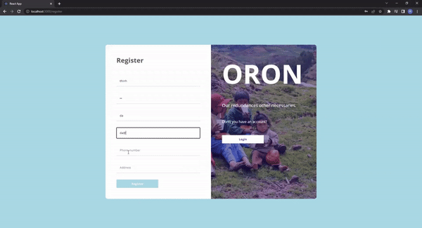
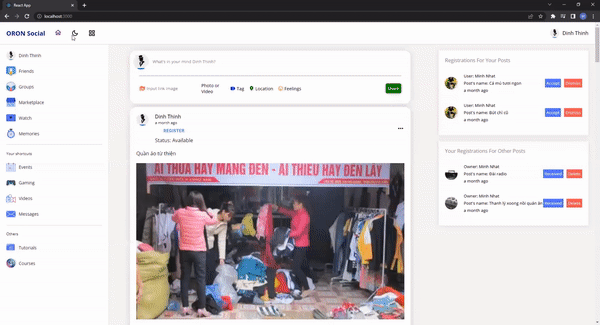
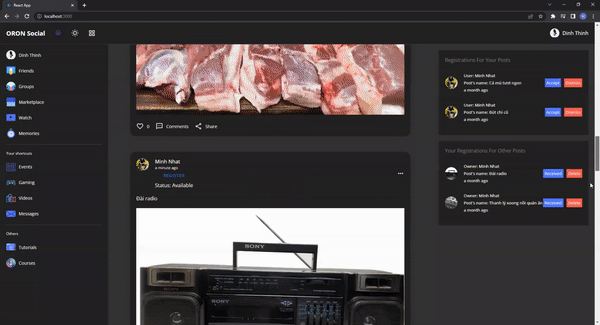
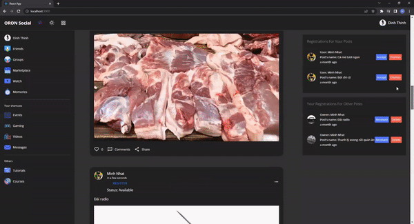
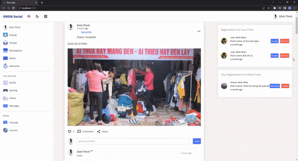
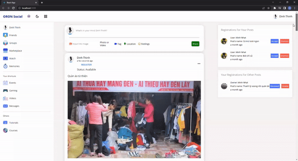
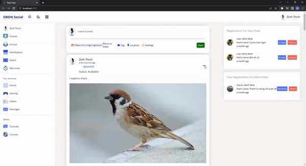
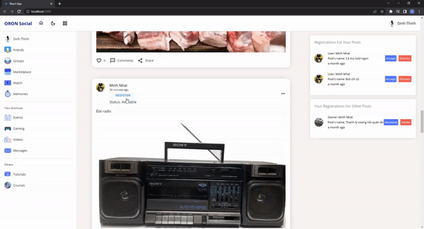
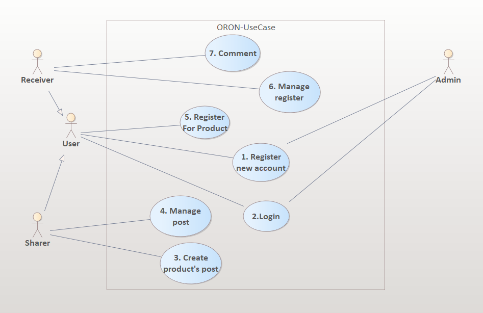

# [ORONUI] React Social Media App Design | Dark/Light Mode & Responsive & HTML CSS

## Introduction

Here is my source code for building the UI of a social media app for users who want to share their redundant food or something, and then others can register to receive those things.

  
  
  
   
  
  
  
   
  
   
  <i>Sample results</i>

## Motivation

 In Vietnam's daily life, I realized that there are many households with excess food that is not used up. Meanwhile, some people need that amount of food for their living, to make pet food for example. Moreover, it is the demand to give and take old things together. From that actual need, I decided to build a social media app dedicated to sharing utensils (food, items,... ) to make this sharing more efficient and convenient and called the application as ORON (Our Redundances Other Necessaries).

## Usecase diagram 

  <i>Usecase diagram</i> 
   
  <i>Link system analysis: [https://docs.google.com/document/d/1A_l-G4DdyuuDWZijfDaK-KKGS3IX7d5YfKWeXW2-wrk/edit?usp=sharing](https://docs.google.com/document/d/1diRNb74MNPIIrjgBVuJY4wnQwGYAeJEsLfGv4ZpVfOQ/edit?usp=sharing) </i> 

## Main components: 
* **Login/Register page**
* **Home page**
* **Profile page**
* **Dark mode with context API**
* **User's post**
* **User's comment/like**

## How to use my code

With my code, you can:
* **Clone project: git clone https://github.com/HdThinh6102git/ORONUIProject/**
* **Open project in Visual Studio Code**
* **In the project directory, you can run:**
  ### `npm install`
  * **load the existing node_modules tree from disk**
  * **clone the tree**
  * **Fetch the package.json and assorted metadata and add it to the clone.**
  * **Walk the clone and add any missing dependencies.**
  * **Dependencies will be added as close to the top as possible.**
 
Now the project is ready. 
  ### `npm start`

  Runs the app in the development mode.\
  Open [http://localhost:3000](http://localhost:3000) to view it in your browser.

  The page will reload when you make changes.\
  You may also see any lint errors in the console.
  ### `npm test

  Launches the test runner in the interactive watch mode.\
  See the section about [running tests](https://facebook.github.io/create-react-app/docs/running-tests) for more information.

  ### `npm run build`

  Builds the app for production to the `build` folder.\
  It correctly bundles React in production mode and optimizes the build for the best performance.

  The build is minified and the filenames include the hashes.\
  Your app is ready to be deployed!

  See the section about [deployment](https://facebook.github.io/create-react-app/docs/deployment) for more information.

  ### `npm run eject`

  **Note: this is a one-way operation. Once you `eject`, you can't go back!**

  If you aren't satisfied with the build tool and configuration choices, you can `eject` at any time. This command will remove the single-build dependency from your project.

  Instead, it will copy all the configuration files and the transitive dependencies (webpack, Babel, ESLint, etc) right into your project so you have full control over them. All of the commands except `eject` will still work, but they will point to the copied scripts so you can tweak them. At this point, you're on your own.

  You don't have to ever use `eject`. The curated feature set is suitable for small and middle deployments, and you shouldn't feel obligated to use this feature. However, we understand that this tool wouldn't be useful if you couldn't customize it when you are ready for it.

## Requirements

* **IDE: Visual Studio Code**

## Acknowledgements
I express my sincere thanks to the teachers of HCMUTE and many online teachers on youtube (such as laptrinhjavaweb.com,...) who taught me lots of knowledge which I used to build this project.
